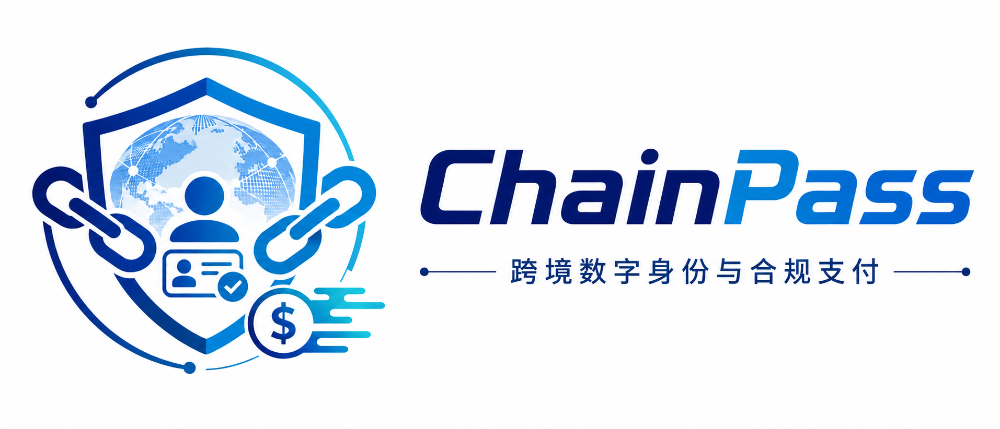

<!-- <p align="center">
  
</p> -->

<h3 align="center">
  <b>基于区块链可信身份技术，构建安全、隐私、可复用的跨境数字身份与合规支付解决方案。</b>
</h3>

<p align="center">
  
  
  
  
  
  
</p>

ChainPass 是一个可运行的**跨境数字身份与合规支付原型系统**：Vue 3 前端调用 Spring Boot API，以 MySQL 保存用户、`did:chainpass` 本地标识、签名凭证、身份审核、跨境订单、可解释风险决策、人工支付复核和多币种测试额度，以 Redis 保存登录态、刷新令牌、汇率缓存和凭证签发密钥。

> 重要边界：本项目没有区块链节点、真实支付通道、外部 KYC 数据源或零知识证明系统。CNY、USD、ETH 都只是内部测试记账单位；`did:chainpass` 不是已注册的公共 DID method；签名凭证使用自定义证明格式，不宣称兼容 W3C Data Integrity cryptosuite。

参赛准备请先阅读 [中国国际大学生创新大赛（2026）适配说明](docs/COMPETITION_2026_COMPLIANCE.md)，并登录系统使用“参赛合规自检”。该功能是内部预检，不代替学校、省级教育行政部门或大赛组委会审核。

## 已实现功能

| 模块 | 可验证行为 | 边界 |
| --- | --- | --- |
| 账号 | 注册、强密码校验、BCrypt、JWT 访问/刷新令牌 | 没有邮件找回密码、扫码登录或第三方登录 |
| 权限 | 用户—角色—权限从数据库加载；管理接口使用方法级授权 | 普通注册用户不自动获得管理权限 |
| 本地 DID | 每个用户创建一个 Ed25519 密钥对；私钥经 AES-GCM 加密后保存；挑战签名验证；本人吊销 | 数据保存在 MySQL，不上链；服务端托管私钥，不是自托管钱包 |
| 签名凭证 | 审核通过后由 Ed25519 签发；可检查签名、有效期、吊销状态和持有者 DID 状态 | 自定义 `ChainPassEd25519Signature2026`，仅保证本服务内互操作 |
| 人工审核 | 用户提交基础身份字段；具备 `compliance:kyc:audit` 权限的审核员批准或拒绝；批准后签发凭证 | 没有 OCR、人脸核验、政府/商业 KYC 数据源，不能用于真实合规决策 |
| 跨境订单 | 采集汇出地、收款地、受益人、支付用途、汇出/到账币种和金额；限制已开放走廊与用途 | 字段结构只用于产品原型，不表示满足某一司法辖区的报送要求 |
| 合规决策 | 复验付款方审核状态与签名凭证；按金额、收款方状态、币种和用途形成分数、等级、理由及自动通过/人工复核/拒绝结果 | 规则是可解释的演示策略，不是法律阈值、制裁筛查、AML 模型或监管认证 |
| 支付复核 | 具备 `compliance:payment:audit` 权限的审核员查看队列、填写依据并放行或拒绝；保存审核人和时间 | 没有四眼审批、案件材料、可疑交易报告或外部监管报送 |
| 内部账本 | 配置汇率换算；按源币扣付款方本金和手续费，按目标币给收款方入账；双向历史和 CSV 导出 | 不产生真实资产或链上交易；开发 profile 才发放初始测试额度 |

## 关键设计

### 身份调用链

1. `/auth/register` 只创建普通账号，密码至少 8 位并同时包含大小写字母和数字。
2. `/auth/login` 验证 BCrypt 密码，生成短期访问令牌和刷新令牌，并把数据库权限快照写入 Redis。
3. `/did/create` 为当前登录用户生成 Ed25519 密钥；`/did/verify` 验证挑战签名；`/did/{did}/revoke` 只能由该 DID 所属用户调用。
4. KYC 提交保持 `PENDING`，不会自动自审。授权审核员批准后，凭证只写入审核等级、审核时间、有效期和策略标识，不把姓名、国籍、证件号复制进凭证。

### 跨境合规支付调用链

1. 双方都必须已有有效 DID 和已初始化钱包。
2. 用户填写汇出/收款国家或地区、受益人、用途、源币金额和目标币种。服务端校验走廊、用途、DID、钱包、余额和配置汇率。
3. 服务端要求付款方人工审核仍在有效期内，并重新验证 `KYCCredential` 的 Ed25519 签名、有效期、吊销状态和持有者 DID；仅有一条数据库状态不足以放行。
4. 规则引擎输出 `riskScore`、`riskLevel`、`complianceDecision` 和可读原因：低风险进入待支付，中风险进入人工队列，高风险或付款方身份门控失败被拒绝。所有结果均落库审计。
5. 审核员可填写依据后放行或拒绝中风险订单；放行后重新给予 30 分钟支付窗口。
6. 付款方确认执行时，系统以条件更新抢占订单，避免并发重复执行。源币本金及手续费从付款方扣除，换算后的目标币金额记入收款方。
7. 双边余额、交易记录与订单完成在同一个数据库事务中；余额更新使用版本号乐观锁，任一步失败都会回滚。

### 当前演示规则

这些数值是为了让各分支可稳定复现的**产品策略**，不是 FATF 或任何国家规定的法定阈值：

| 条件 | 分数/结果 |
| --- | --- |
| 付款方缺少有效审核记录或无法通过签名凭证复验 | 直接拒绝 |
| 收款方缺少有效审核记录和凭证 | +25 |
| 受益人姓名与收款方已审核姓名不一致 | +50，进入人工复核；不把不一致直接解释为欺诈 |
| CNY 等值金额达到 10,000 / 50,000 | +35 / +60 |
| 使用 ETH 测试记账单位 | +20 |
| 商业用途 | +10 |
| 总分 0–39 / 40–79 / 80–100 | 自动通过 / 人工复核 / 拒绝 |

规则命中理由随订单保存，便于演示“为什么被拦截”，而不是输出不可解释的黑盒分数。

## 本地启动

要求：JDK 17、Maven 3.9、Node.js 20.19+、pnpm 9+、Docker Compose。

先生成三个互不相同的秘密值（下面的 PowerShell 示例只把它们放在当前终端）：

```powershell
$env:JWT_SECRET = [Convert]::ToBase64String([Security.Cryptography.RandomNumberGenerator]::GetBytes(64))
$env:DID_KEY_SECRET = [Convert]::ToBase64String([Security.Cryptography.RandomNumberGenerator]::GetBytes(32))
$env:ISSUER_KEY_SECRET = [Convert]::ToBase64String([Security.Cryptography.RandomNumberGenerator]::GetBytes(32))
$env:DB_USERNAME = 'chainpass'
$env:DB_PASSWORD = 'chainpass_secure_password_change_this'
$env:REDIS_PASSWORD = 'chainpass_redis_password'
```

启动基础设施和应用：

```powershell
docker compose -f docker/docker-compose.yml up -d
pnpm install
mvn -f apps/server/pom.xml spring-boot:run -Dspring-boot.run.profiles=dev
```

另开终端启动前端：

```powershell
pnpm dev
```

访问前端 `http://localhost:5173`，OpenAPI UI 为 `http://localhost:8080/swagger-ui/index.html`。数据库仅为本地开发写入初始管理员 `admin / AdminPass2026!`，首次登录应立即修改；部署环境应删除该种子账号。

Docker 已挂载 `docker/mysql/init-v2.sql`。如果以前启动过旧版本，MySQL volume 不会自动重跑初始化脚本；先备份数据，再执行 `docker/mysql/upgrade-v2.2-cross-border.sql`（仅一次），或在确认不需要旧数据后重建开发 volume。

## 验证

```powershell
pnpm --filter @chainpass/web type-check
pnpm --filter @chainpass/web build
mvn -f apps/server/pom.xml test
```

后端单元测试覆盖 DID 创建/有效性、凭证签发/状态验证，以及钱包、订单、币种换算等核心分支。完整联调仍需要 MySQL 与 Redis；OpenAPI 可用于逐步复现注册 → 登录 → DID → 钱包 → KYC 申请/审核 → 凭证复验 → 跨境订单 → 自动决策/人工复核 → 内部记账流程。

## 零成本但需要人工完成的操作

1. 安装免费的 Temurin/OpenJDK 17 与 Maven 3.9，并确认 `java -version`、`mvn -version` 可用；本仓库不捆绑 JDK。
2. 准备本地 MySQL 8 和 Redis 7。可使用已有 Docker/Podman，或直接安装社区版服务；首次启动用 `init-v2.sql`，旧库先备份再执行一次 V2.2 升级脚本。
3. 按“本地启动”生成三项随机秘密，不能把真实值提交到 Git。开发种子管理员首次登录后立即改密。
4. 至少注册付款人和收款人两个普通账号，分别创建 DID、初始化钱包并提交 KYC；再用管理员完成两人的人工审核，才能复现凭证门控。
5. 分别创建小额订单、`BUSINESS + 10,000 CNY` 等值订单和缺少付款方凭证的订单，复现自动通过、人工复核和拒绝三条路径；审核通过后付款人在原页面点击“刷新复核状态”再确认支付。
6. 把仓库推送到自己的 GitHub 后，现有 GitHub Actions 会免费执行前端类型检查/构建、后端测试和 Trivy 报告（实际免费额度以你的 GitHub 账户和仓库可见性为准）。

这些操作能把现有原型完整跑通，但不会凭空增加真实身份数据源、真实资金通道或监管资质。

## 尚未完成且没有伪装成已完成的部分

- 没有公共 DID method 的解析器、方法规范和注册流程。
- 没有 RDF/JSON-LD canonicalization，也没有 W3C VC Data Integrity EdDSA cryptosuite。
- 没有真实 KYC 供应商、证件图片上传、制裁/PEP/负面新闻数据、设备风险、关系网络或持续交易监控。
- 没有真实汇率源、支付机构、银行接口、区块链结算或退款。
- 没有各司法辖区规则包、Travel Rule 消息互操作、案件管理、可疑交易报告、监管报送和合规认证。
- KYC 原始字段目前保存在项目数据库中；投入真实数据前必须增加字段级加密、保留期、删除流程和审计访问控制。
- 没有端到端浏览器测试和真实基础设施集成测试。

## 前沿演进方向

当前实现把三项可实际验证的方向组合在同一条调用链：审核凭证的数据最小化、签名凭证驱动的支付门控，以及“自动决策 → 人工复核 → 原子双边记账”的可解释状态机。设计参考 [W3C Verifiable Credentials Data Model 2.0](https://www.w3.org/TR/vc-data-model-2.0/) 对签发者、持有者、验证者及业务规则分工的定义，也参考 [FATF Digital Identity Guidance](https://www.fatf-gafi.org/en/publications/Financialinclusionandnpoissues/Digital-identity-guidance.html) 的风险导向思路；这只是设计借鉴，不构成标准符合性或法律合规声明。

下一步若要进入标准互操作，应优先实现 W3C VC 2.0 和 [Data Integrity](https://www.w3.org/TR/vc-data-integrity/) 的规范数据及证明套件；若要实现选择性披露，应选用已标准化或公开审查的机制并建立正式威胁模型，而不是把普通签名改名为“零知识证明”。若要接近生产合规，应先确定具体牌照主体和司法辖区，再接入受许可的身份、制裁、汇率和资金服务商，并由合规与法律人员验证规则包。

## License

MIT
